# AWS SQL (Structured Query Language) Server RDS (Relational Database Service)

- [AWS SQL (Structured Query Language) Server RDS (Relational Database Service)](#aws-sql-structured-query-language-server-rds-relational-database-service)
  - [Installation of SQL Server](#installation-of-sql-server)
  - [Installation of SQL Server Management Studio](#installation-of-sql-server-management-studio)
  - [AWS Relational Database Service (RDS)](#aws-relational-database-service-rds)
    - [Steps to set up a SQL Server RDS database](#steps-to-set-up-a-sql-server-rds-database)
      - [Over-provisioned or under-provisioned](#over-provisioned-or-under-provisioned)
    - [AWS CLI SQL Server RDS configuration](#aws-cli-sql-server-rds-configuration)
    - [Create S3 backup](#create-s3-backup)
  - [Using SQL](#using-sql)
    - [Create a Database](#create-a-database)
    - [Write to DB](#write-to-db)

## Installation of SQL Server

1. Go to this [download link](https://www.microsoft.com/en-gb/sql-server/sql-server-downloads).
2. Scroll down and select the free download option 'Developer' by clicking on the 'Download Now' button as shown in the image: 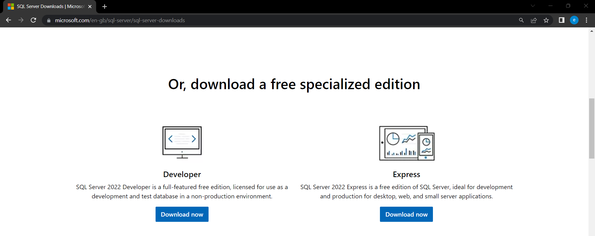
3. Open the downloaded file.
4. Select the 'Custom' installation type option.

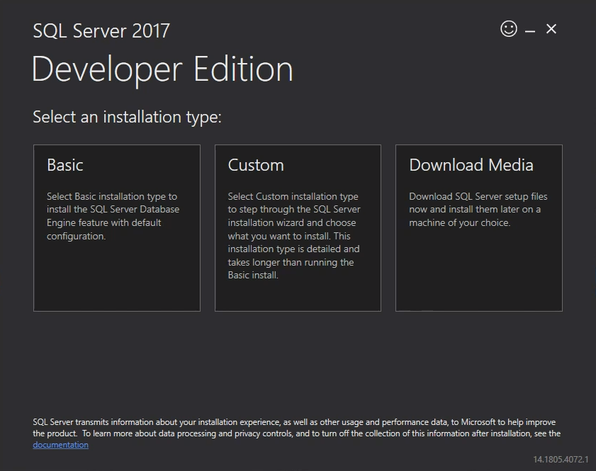

5. You may leave the file path as the default one or edit it as you wish then click the 'Install' button.
6. In the SQL Server Installation Center that appears after installation click on 'Installation' tab down the side, then click this selection 'New SQL Server standalone installation or add features to an existing installation'.

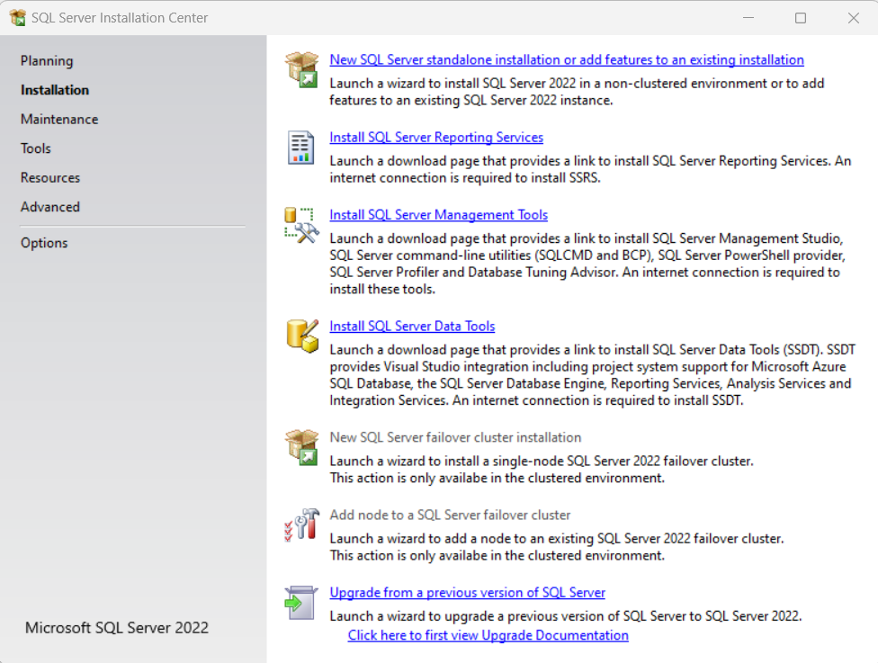

7. Leave the Developer free edition selection and click 'Next'.

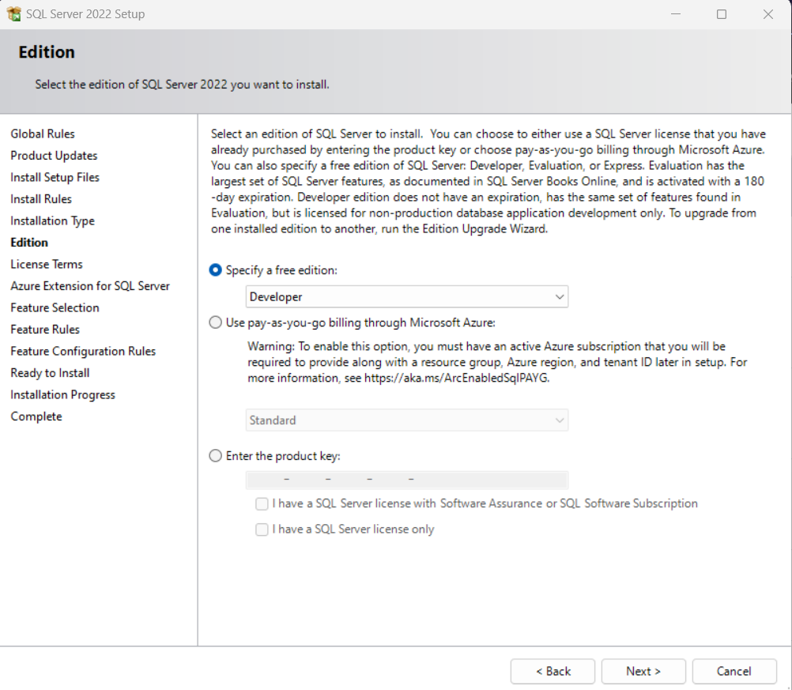

8. Accept the license terms and conditions and click 'Next'.
9. You may select 'Use Microsoft Update to check for updates (recommended)', but it is optional, then click 'Next'.
10. Once all the rules have the 'Pass' status or 'Warning' status as shown in the following image, click 'Next'.

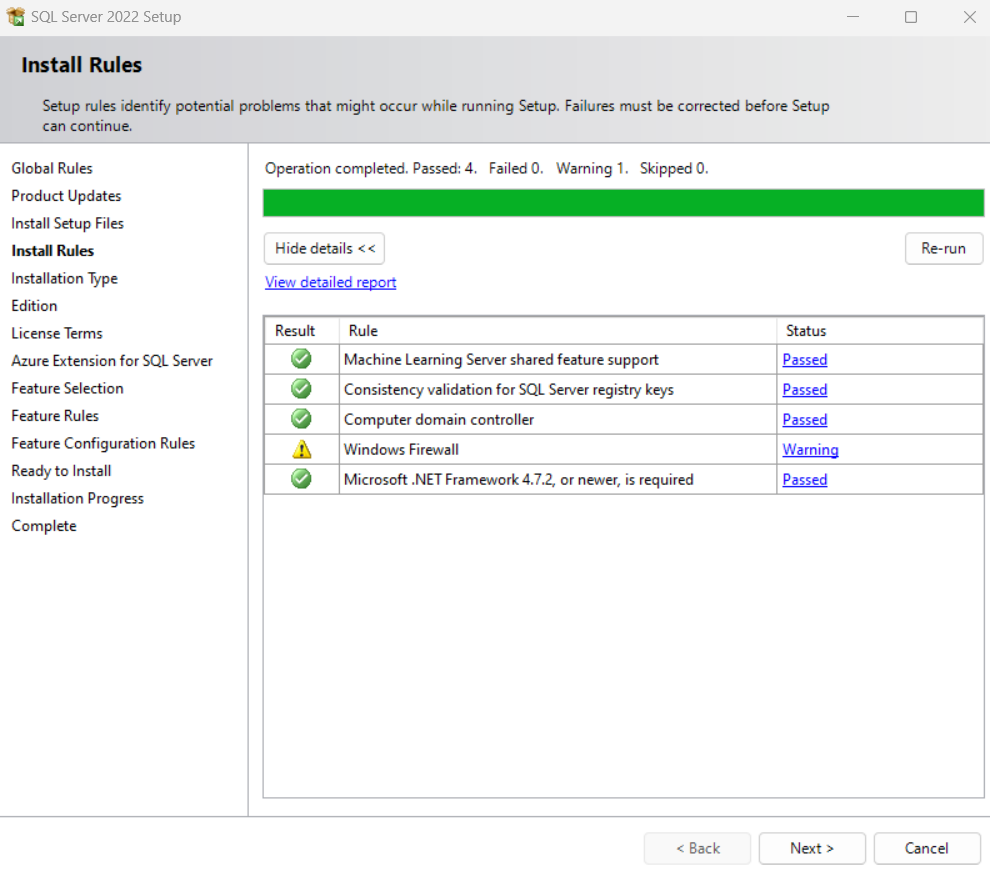

11. Uncheck the Azure extension, then click 'Next'.

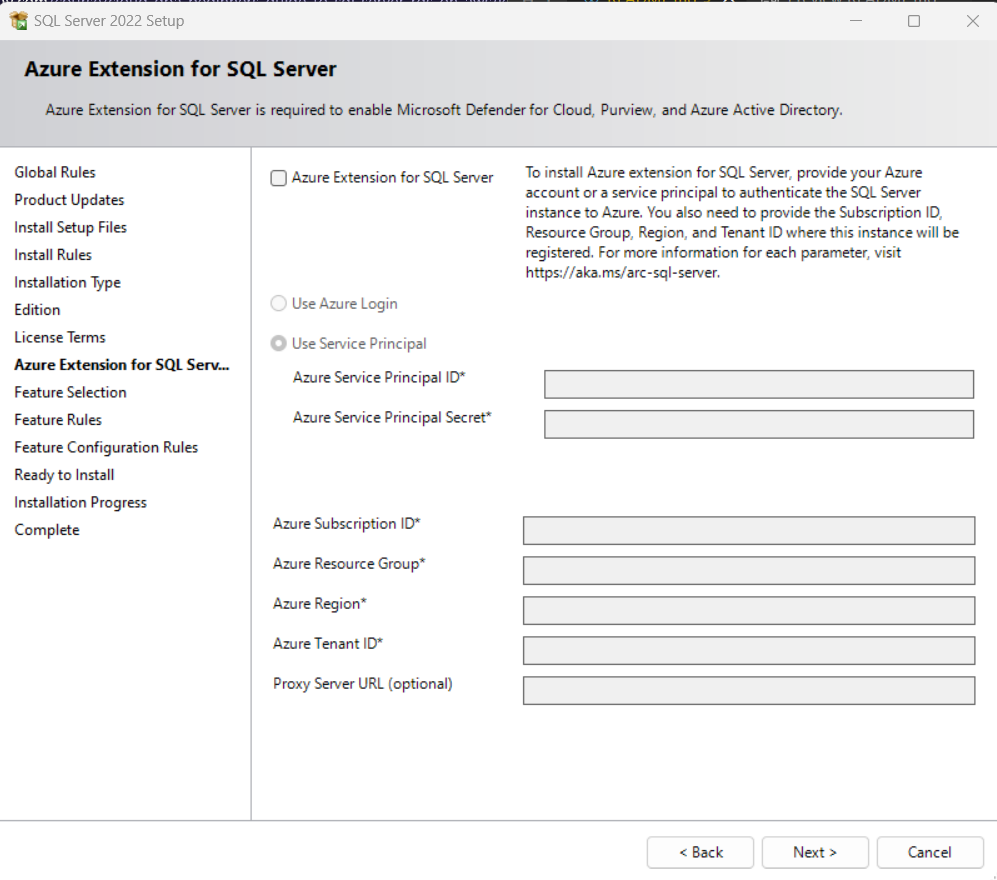

12. For 'Feature Selection' check 'Database Engine Services' and 'Integration Services', then click 'Next'.

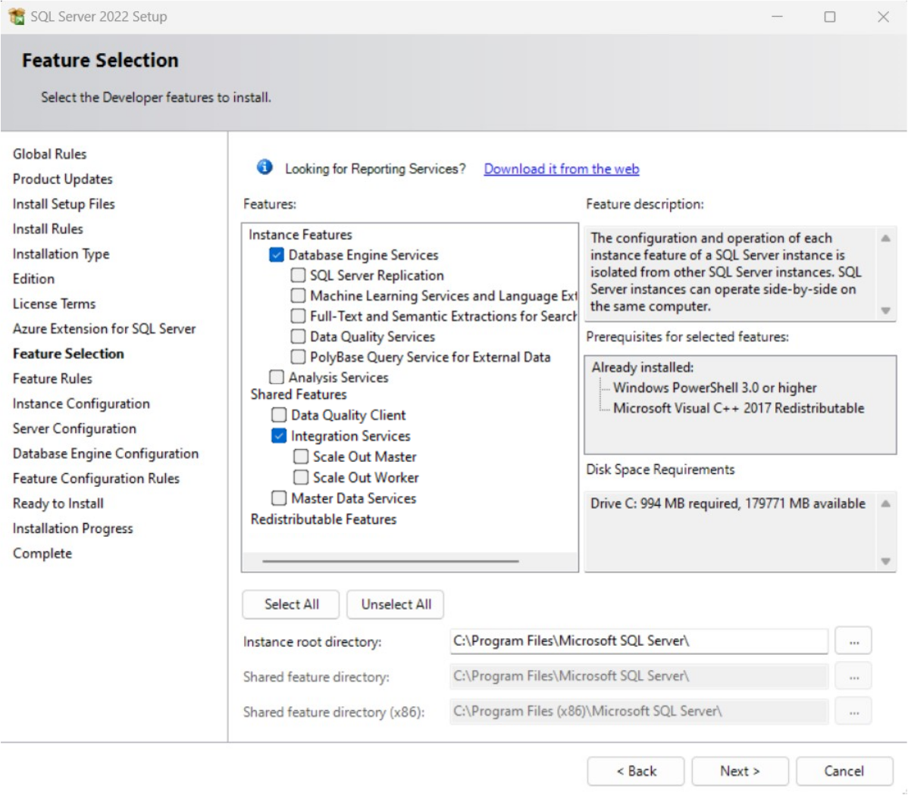

13. For Instance Configuration leave 'Default instance' selected and instance ID as 'MSSQLSERVER'. Click 'Next'.
14. For 'Server Configuration' just click 'Next'.
15. 'Database Engine Configuration' you need to leave the Authentication Mode as 'Windows authentication mode', but you need to click 'Add Current User' and it should show up in the white box with your computer name and user details before clicking 'Next'.


16. Then click 'Install' and let it install.
17. Once it shows you the 'Complete' page with the successful installations you can click 'Close'.

## Installation of SQL Server Management Studio

1. If you still have the 'SQL Server Installation Center' open to the Installation tab you can click on 'Install SQL Server Management Tools'. Otherwise just go to this [link](https://learn.microsoft.com/en-us/sql/ssms/download-sql-server-management-studio-ssms?view=sql-server-ver16). Both will take you to the SQL Server Management Tool download page.
2. When on the page scroll to the 'Download SSMS' section and click the download link just below the heading.

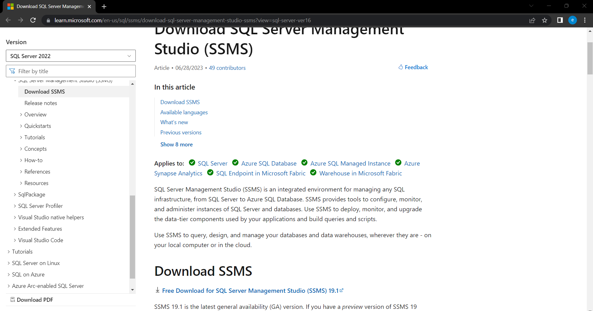

3. Once downloaded, run the downloaded file.
4. Click 'Install'.

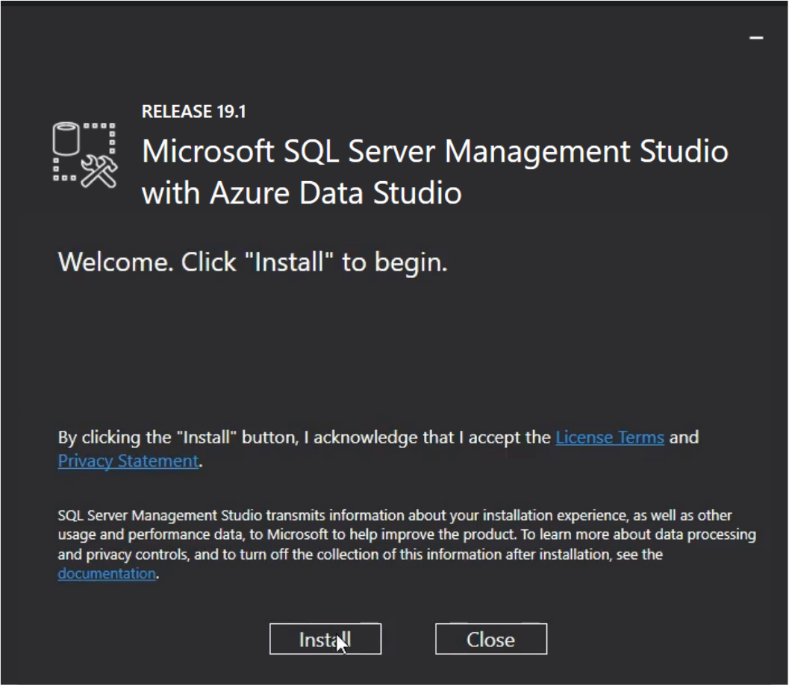

5. Once it is complete you will see the 'Setup Completed' page. Then you can click 'Close'.
6.  You can open it from your 'Start menu'.

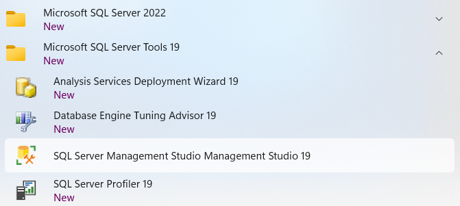

7. When you open it it will have the 'Connect to Server' page, which has the name of your computer to use Windows Authentication. You can just click 'Connect' to connect. And then it should be set up and ready to use.

## AWS Relational Database Service (RDS)

[AWS RDS documentation](https://docs.aws.amazon.com/AmazonRDS/latest/UserGuide/Welcome.html)

Using a cloud-based database system:

- Saves you the time and trouble of updating, patching and maintaining your own database server.
- Allows for faster deployment of servers.
- Automated backups/snapshots can be put in place for easier reversion/recovery.
- Monitoring can be done with online tools to keep your database up and running 24/7.
- Track your spending/billing on the 'Billing Dashboard' (i.e. set up Budgets etc.).

### Steps to set up a SQL Server RDS database

1. Go to AWS and log in to console.
2. Search for RDS and click on it.
3. Click the orange 'Create database' button.
4. Select 'Standard create'.
5. For 'Engine options' select 'Microsoft SQL Server' from the options.
6. For 'Edition' select 'SQL Server Express Edition' to keep costs down (the other options require licenses).
7. For 'Version' stick to the default selection (whatever that may be).
8. In the 'Templates' selection select the 'Free tier' option (again to keep costs down).
9. In the 'Settings' section give the database instance a name and then in the Credentials Settings create your Master username and password.
10. In the 'DB instance size' section it should have selected the 'db.t2.micro' size as it is free tier.
11. In the 'Storage' section you can select the 'Storage type' as 'General Purpose (SSD)'. (Note: There are 3 options 'General Purpose (SSD)' - which is for varying workloads not much performance, 'Provisioned IOPS (SSD)' - for a high performance system, and 'Magnetic' - old-style type, not high performance.) Allocate '20 GiB' of 'Allocated storage'. Uncheck the 'Enable storage autoscaling' (again to reduce cost).
12. In the 'Connectivity' section you can select a 'VPC' to place the database in and in the Additional configurations you may select the 'Subnet group'. Make the database accessible to SSMS by selecting 'Yes' under 'Public access'. Furthermore you can add a VPC security group (database default port: `1433`) and an 'Availability Zone'.
13. You may enable Microsoft SQL Server Windows Authentication if you want. (did not this time)
14. In 'Additional configuration' you can select a 'Time zone' or a different 'Collation'. And Backup routines, Monitoring, or 'Enable auto minor version upgrade' under 'Maintenance' and select when these should take place, and under 'Deletion protection' you can 'Enable deletion protection' to help prevent accidental database deletions. (left all as default this time)
15. Click 'Create database'. Will show as 'Available' under 'Status'.
16. To connect to the database through SSMS get/copy the 'Endpoint' (in the format: `<db-instance-name>.<random-id>.<region-id>.rds.amazonaws.com`) in the 'Connectivity & security' tab of your database instance information page on AWS.
17. Open SSMS. If the 'Connect to Server' popup appears then continue to step 18. If the popup does not appear click 'Connect' dropdown under 'Object Explorer', and then 'Database Engine'.
18. In the popup 'Connect to Server' paste in the 'Endpoint' you copied as the 'Server Name:' and add the port directly after as `,1433`, select 'SQL Server Authentication' and enter the 'Login' and 'Password' you created for your RDS database. Then click 'Connect'.
19. Now you have access to the RDS Database to do what you want/need.
20. If you want to take a snapshot click the 'Actions' dropdown and select 'Take a snapshot'. Then name the snapshot and click 'Take snapshot'. (Note: Snapshots can be found 'RDS' > 'Snapshots'. They are a centralized method for creating native backups which are sent to S3 and can be left for long term storage.)
21. If you want to delete the database as you will not be using it for a long time (or so it does not incur costs by running), then click on the 'Actions' dropdown and 'Delete'. You may take a Snapshot or retain backups if needed and then confirm the deletion.

Note: You can modify db instances (name and configurations) after they have been created by clicking 'Modify'.

#### Over-provisioned or under-provisioned

IOPS = Input/Output Operations Per Second. Form of measurement used to benchmark storage devices.

You can determine whether your server is over or under provisioned by looking at your read IOPS, write IOPS and Queue Depth.
Queue Depth between 0-0.5 = overprovisioned; above 2 = underprovisioned.

For a smoother database use use the IOPS calculation: write IOPS (at a certain point in the day) + read IOPS (at a certain point in the day). For every GiB of Disk space you get 3 IOPS. Provision that amount of IOPS at Provisioned IOPS Disk, or increase General Purpose Disk for the right size (eg. for 900 IOPS get 300 GiB disk). To add this click 'Modify' and change the instance size or storage type with the provisioned IOPS etc.

### AWS CLI SQL Server RDS configuration

1. AWS CLI download and install [here](https://aws.amazon.com/cli/).
2. Create an IAM role for your User and select 'Programatic access' to get the neccessary keys for the CLI (download the csv version when the option arrives as you will not have access to do so later). Add user(s) to group with needed access permissions. Then set up in terminal with `aws configure`.
3. Use the terminal to create the RDS instance using the following command:

```shell
# tells aws to create and RDS instance called rds-database-name-1 with 20 GiB storage with a db.t2.small instance type, with the express version of SQL, with the specified username and password, and port access at port 4601 and it is publicly accessible so SSMS can connect with it.
aws rds create-db-instance --db-instance-identifier rds-database-name-1 --allocated-storage 20 --db-instance-class db.t3.small --engine sqlserver-ex --master-username gctesting --master-user-password gctesting --port 4601 --publicly-accessible
# verify creation of database instance
aws rds describe-db-instances --db-instance-identifier rds-database-name-1
```

4. Connect the same way as in steps 17 - 19 above. (except add `,4601` instead of `,1433` to Endpoint)

Note: If the connection times out or there is an error you need to log in to AWS and go to the RDS database Security Group and add your IP address with the required port number by editing inbound rules and adding a rule and then saving it.

5. To take a snapshot

```shell
# create snapshot
aws rds create-db-snapshot --db-instance-identifier rds-database-name-1 --db-snapshot-identifier my-db-snapshot
# verify snapshot creation
aws rds describe-db-snapshots --db-snapshot-identifier my-db-snapshot
```
6. To delete the RDS instance from the CLI use the following command:

```shell
aws rds delete-db-instance --db-instance-identifier rds-database-name-1 --skip-final-snapshot
```

### Create S3 backup

1. Create an S3 bucket on AWS.
2. Go to 'RDS' > 'Option groups', then click on 'Create group'.
3. Give the Option Group a Name, a description (eg. sqlbackup), and select `sqlserver-ex`, if using the Express version of SQL, as the 'Engine'. Then choose 'Major Engine Version' (SQL 2017 is 14.00). Then click 'Create'.
4. Select option group and click 'Add option'.
5. 'Option name' select 'SQLSERVER_BACKUP_RESTORE'. Provide an IAM role to provide access to the S3 bucket. Choose the S3 bucket you created. Select the 'Immediately' option under scheduling. Then click 'Add options'.
6. Go to 'RDS' > 'Databases'. Select your database and click 'Modify'. In the 'Additional configuration' section under 'Database options' > 'Option group' select the option group you created. Then click 'Continue', then 'Apply immediately' and 'Modify DB instance'.
7. Connect to your instance using SSMS and create a database.
8. Create a backup for your database using the following commands:

```shell
# create a backup in your s3 bucket
exec msdb.dbo.rds_backup_database 
        @source_db_name='rds-database-name-1',
        @s3_arn_to_backup_to='arn:aws:s3:::db-backup-bucket-name/rds-database-name-2.bak',
        @overwrite_S3_backup_file=1,
        @type='FULL';

# check status of backup
exec msdb.dbo.rds_task_status @db_name='rds-database-name-2';
```

Note: you can create a local backup of your database, then upload it to S3 and restore on AWS using the command in step 9 below.

9. You can restore your database from the backup using the following command:

```shell
# restore database from S3 bucket
exec msdb.dbo.rds_restore_database 
        @restore_db_name='rds-database-name-2', 
        @s3_arn_to_restore_from='arn:aws:s3:::db-backup-bucket-name/rds-database-name-2.bak';
# check status of restore
exec msdb.dbo.rds_task_status @db_name='rds-database-name-2';
```

## Using SQL

### Create a Database

1. When connected to the SQL Server of your database you can click on the 'Databases' folder and right click and select 'New Database'.

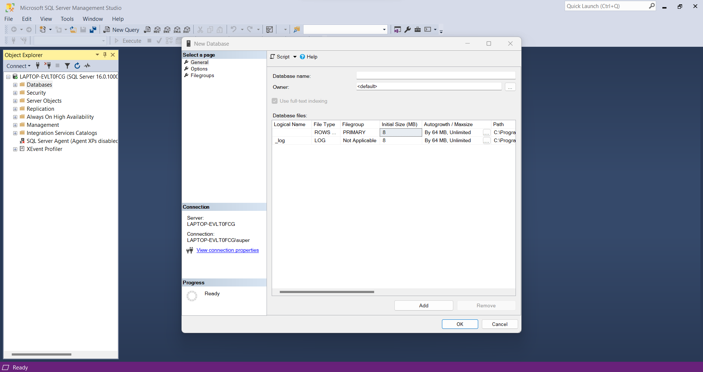

2. Give your database a name (and optionally configure other settings) in the popup and then click 'OK'. (If you need to do an automated task in AWS RDS you need to use a method to go through the AWS portal.)
3. If you want to delete the database you would need to click on the `+` next to the Databases folder and then right-click on your database and click 'Delete', then check 'Close existing connections' and click 'OK'.

### Write to DB

1. Right-click on database name. Select 'New Query'.
2. Write queries in the SQL like the following example:

```sql
-- Create the table
CREATE TABLE your_table_name (
    id INT PRIMARY KEY,
    name VARCHAR(50),
    age INT,
    email VARCHAR(100)
);

-- Insert dummy entries
INSERT INTO your_table_name (id, name, age, email) VALUES
(1, 'John Doe', 25, 'john.doe@example.com'),
(2, 'Jane Smith', 30, 'jane.smith@example.com'),
(3, 'Michael Johnson', 35, 'michael.johnson@example.com');
```
